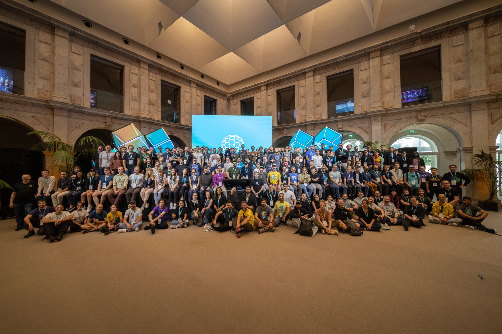

## Getting There
Heading to [IPFS Camp 2022](https://2022.ipfs.camp/) on Thursday October 27, my flight scheduled for 2:53 pm, racing through Atlanta I realized I forgot my coat half-way to the airport. No time to retrieve it, I found myself aboard United flight 1829 to Newark, NJ arriving at EWR about 2 and a half hours later (without a coat). I was waiting for my connecting flight to Lisbon when they announced a gate change. Walked with the others down to the new gate. In the air at 2035 we arrived at about 0820 Friday morning and made our way to Portuguese customs.

It is *already* time, I find a taxi outside the airport. Lucky the taxi drivers' English is far superior to my Portuguese, it cost a mere 10 Euros for the ride to the Convento do Beato and Day 1 of IPFS Camp!

After a full night of travel I was excited to get into the conference and get technical - however jet lagged.

## Day 1
Day 1 is a bit of a blur, as the IPFS Camp speakers regaled us with the latest happenings in IPFS. [JS-IPFS](https://js.ipfs.tech/), [IPVM](https://fission.codes/blog/ipfs-thing-breaking-down-ipvm/), [Iroh](https://iroh.computer/) (Rust implementation of IPFS) and Filecoin and NFTs; oh my! I attend the Keynotes, and then learn about plans to “decentralize all of the things!” [Alternative IPFS implementations](https://youtu.be/HRYREdsLt5k), then the IPFS project expo where I was able to experiment with Fission’s IPVM.

### Iroh
The [Iroh story](https://youtu.be/qPBR2K2X6cs) is compelling, because they have a complete IPFS implementation in Rust.

### js-ipfs
[js-ipfs](https://youtu.be/pXOBE9tfevQ) is interesting, because they’re capable of running in both node and the browser. Might try it in Rhino as well. But these days Rust is the language I use for my primary day to day development at work.

### IPVM
The [IPVM story](https://youtu.be/rzJWk1nlYvs) is also compelling, because they intend to host WASM VMs as potentially a new kind of "serverless" infrastructure. The ability to use distributed data as executable code in a decentralized cloud is fascinating technically.

Feeling exhausted, and having been awake since Thursday, I took an Uber back to the hotel, checked-in, showered and slept. I note the shower is significantly raised and breakfast is served at 7 am.

## Day 2
 I breakfast and hop in an Uber and back to the Convento do Beato, where I attended talks on Web 3; especially memorable were [IPLD](https://ipld.io/), [WNFS](https://guide.fission.codes/developers/webnative/file-system-wnfs) and [Graphsync](https://github.com/myelnet/rs-graphsync).

[IPLD is a data modeling language](https://youtu.be/J_Q6hF_lPiM). Used to model graph based data structures. Primary use case is for blockchain with-in filecoin.
WNFS is a file system built on top of IPFS. Offers pinning services. This sounds conceptually like what we're building.
Graphsync is used by Filecoin for syncing the blockchain. Possibly a good fit for syncing blockchains. Requires IPLD.
The measurement and performance unconference includes many interesting projects, especially [Testground](https://docs.testground.ai/).

## Day 3
It's libp2p day so I sit at the presenter's table and prepare for [my talk](https://youtu.be/aIxmQKWUjNY). Internet is spotty (it is a former convent) so I setup my phone as a Hotspot (my fellow presenters are especially grateful) and download the Docker image I intend to use for my talk (it works so much faster when you precache your data, but we really should use something heavier than Alpine); the audience appears to appreciate the demo working at all (as the Internet was not working in the convent at the time) and the demo impresses.

Answering questions, and interacting with others' at libp2p day yields several insights into behaviors we are seeing in our p2p network. For example, we should be implementing [PING](https://docs.rs/libp2p/latest/libp2p/ping/index.html) as that provides a heartbeat mechanism and would allow our peers to timeout far more efficiently (currently can take 12 minutes).

Once again it is late, Uber to the hotel, eating and sleeping. 

Sadly, now IPFS camp is over, but I am glad that I was able to be here and have these conversations and make great connections!

Please checkout [my talk](https://youtu.be/aIxmQKWUjNY) and the [slides](https://docs.google.com/presentation/d/1rn0NKAoTpxyA2iTPE_8fkEqKI3ke8xu9gnhcLyrm7Dk) to learn more about [Pyrsia](https://pyrsia.io/).
